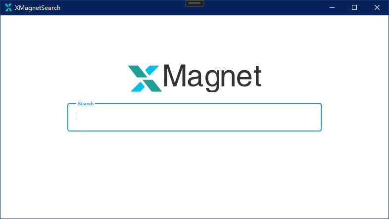

# XMagnetSearch

 

  

<h3 align="center">磁力聚合搜索</h3>
  

    一个简单的磁力聚合搜索软件
     
    
          
    <a href="https://github.com/fallingrust/XMagnetSearch/releases"><strong>前往下载 »</strong></a>
        
  

### 支持的网站
- [BTSOW](https://btsow.motorcycles)
- [czechsearch](https://eusjdkws.lol)
- [吃力网](https://11h.sokk24.buzz)
- [~~种子搜~~](https://m.zhongziso365.xyz)
- [菲特动漫](https://fitacg.com)
- [搜番](https://ae.sefan.cc/)
- [磁力熊](https://www.cilixiong.com/)
- [动漫花园](https://garden.onekuma.cn/)

### 使用方式 
- [前往Release下载最新包](https://github.com/fallingrust/XMagnetSearch/releases)
- [安装Dotnet Desktop Runtime](https://dotnet.microsoft.com/zh-cn/download/dotnet/8.0)
- 输入资源名称，回车
- 双击复制链接至剪切板

### 使用到的框架
- [AngleSharp](https://github.com/AngleSharp/AngleSharp)
- [Prism](https://github.com/PrismLibrary/Prism)
- [MaterialDesignInXamlToolkit](https://github.com/MaterialDesignInXAML/MaterialDesignInXamlToolkit)
- [SharpVectors](https://github.com/ElinamLLC/SharpVectors)

